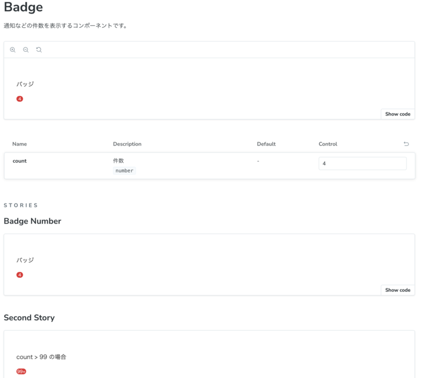

# Storybook運用ルール

## storybookの用途

- エンジニア向けのカタログ
- VRTのスクリーンショットテスト
- storybook Playによるテスト(詳細は別途記載)

## カタログとして公開されるべき要素

- コンポーネントの名前
- 使用用途 / コンポーネントの役割
- props
- 各種表示パターン

### カタログイメージ

※Docsとしてstorybook上で見れるようにする。(以下イメージ)



### storybook作成時の注意点

各コンポーネントにjs-doc(`/** */`で囲まれた部分)を記載してください。

記載内容は`使用用途/コンポーネントの役割`です。
以下に例を記載します。

```ts title="example.tsx"
/**
 * 通知などの件数を表示するコンポーネントです。
 */
const Bage = fowardRef<HTMLDivElement, BageProps>(
  ({ClassName, ...props}, ref) => {
    return (
      --- 省略 ---
  )
})
```

## testが行えるようにするためのstorybookとして求められる実装要素

- defaultのUI
- 表示パターン別のUI
- ボタン、ラジオボタン、チェックボックスのクリック時のUI変化(色等)
- StorybookPlayによるテストコード(詳細は別途記載)